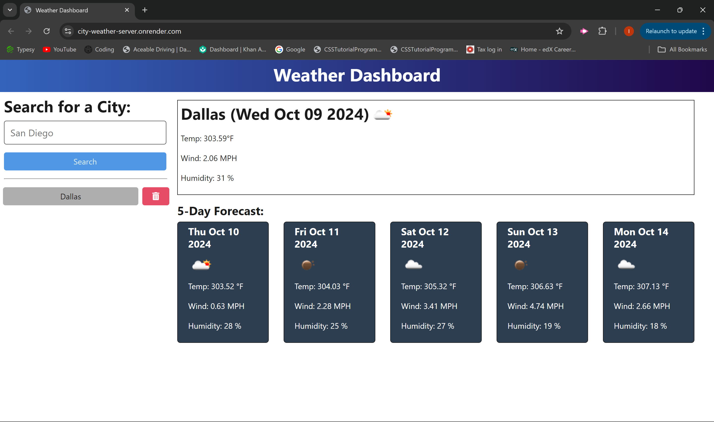

# City Weather Server
## Description
  This is a server side application for getting weather by API and sending it to the requested client.
## Table of Contents
  [Description](#description)  
  [Installation](#installation)  
  [Usage](#usage)  
  [License](#license)  
  [Contributing](#contributing)  
  [Tests](#tests)  
  [Questions](#questions)  
## Installation
  Prerequisites: Node.js, npm  


  Install npm packages:``` npm run install ```  

Build dependencies: ```npm run build```  


## Usage
  Start server by runnning: ```npm run start```  
  or  
  Use this link: https://city-weather-server.onrender.com/
  
## License
  []()
  
## Contributing
  1. Fork the repository.  
  2. Create a new branch: ``` git checkout -b feature/branch-name ```  
  3. Make your changes.  
  4. Submit a pull request.
## Tests
  There are no tests
## Questions
  For any questions, contact here:  
  Isaiah Hansen: isaiah1hansen@gmail.com  
  GitHub: [KeelerZoroth](https://github.com/KeelerZoroth)  
